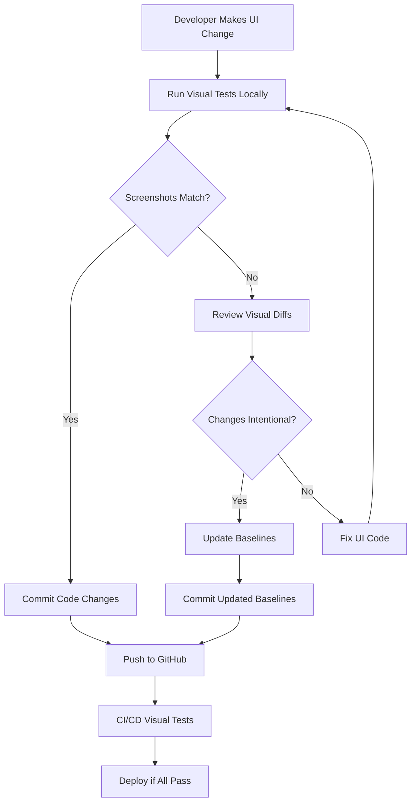
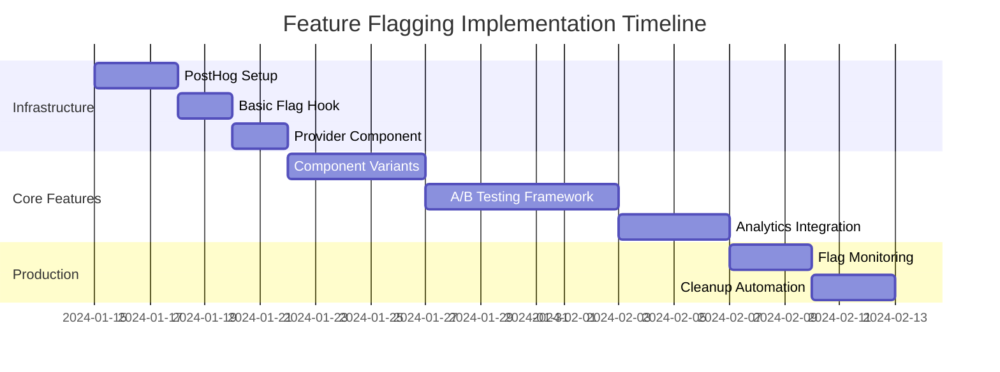
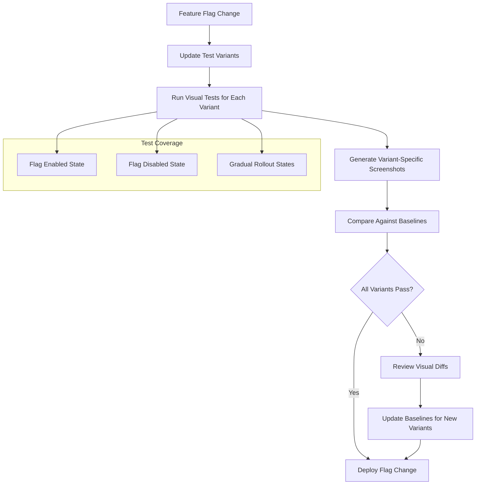

# Visual Regression & Feature Flagging Strategy

## Visual Regression Management

### ✅ Git LFS Setup Complete

We've configured Git LFS to properly manage Playwright visual regression screenshots:

```bash
# Already configured:
git lfs track "src/tests/**/*.png"
```

**What this means:**

- ✅ **Version controlled baselines**: All team members have consistent visual references
- ✅ **Efficient storage**: Large PNG files stored in LFS, not bloating the main repository
- ✅ **Easy collaboration**: Visual changes can be reviewed and approved like code changes
- ✅ **Rollback capability**: Can easily revert visual baselines if needed

### Playwright's Recommendation: ✅ YES, Commit Screenshots

**Microsoft's official guidance** for Playwright visual regression:

1. **Commit baseline images to Git** - Essential for team consistency
2. **Use Git LFS for large binary files** - Prevents repository bloat
3. **Store screenshots close to tests** - Easier maintenance and discovery
4. **Platform-specific baselines** - Different screenshots for different OS/browsers

### Our Implementation Strategy



### File Structure

```
src/tests/
├── test-results/           # Temporary (gitignored)
├── screenshots/            # Git LFS tracked
│   ├── homepage-chromium-linux.png
│   ├── homepage-firefox-linux.png
│   ├── homepage-webkit-linux.png
│   └── mobile/
│       ├── homepage-chrome-mobile.png
│       └── homepage-safari-mobile.png
├── e2e/
│   ├── homepage.spec.ts
│   └── visual-regression.spec.ts
└── README.md              # Comprehensive test documentation
```

## Feature Flagging Integration

### Recommended Solution: PostHog

Based on comprehensive research, **PostHog** is the optimal choice for Morning Pod:

#### PostHog Advantages

- **Free tier**: 1M feature flag requests/month
- **Analytics integration**: Track experiment results seamlessly
- **Session replay**: See how flags affect user behavior
- **Advanced targeting**: Geographic, user properties, cohorts
- **Multi-environment**: Dev, staging, production flags
- **Open source**: No vendor lock-in

#### Implementation Roadmap



### Key Questions & Decisions

#### 1. Platform Choice: PostHog ✅

- **Why**: Best free tier, comprehensive analytics, future-proof
- **Alternative**: Vercel Edge Config for high-frequency operational flags

#### 2. Flag Types Priority:

1. **Release toggles**: New podcast generation features
2. **Experiment toggles**: Component variants (episode cards, players)
3. **Ops toggles**: Performance circuit breakers
4. **Permission toggles**: User role-based features

#### 3. Evaluation Strategy: Hybrid Approach

- **Client-side**: Cached flags for performance
- **Server-side**: Secure evaluation for sensitive features
- **Edge**: High-frequency operational toggles

#### 4. Experimentation Focus:

- **Component A/B testing**: Episode card variants, player designs
- **User experience**: Navigation patterns, onboarding flows
- **Performance**: Different AI models, caching strategies
- **Content**: Source selection algorithms

#### 5. Flag Hygiene: Automated Lifecycle

- **Creation**: Require documentation and cleanup dates
- **Monitoring**: Track usage and performance impact
- **Cleanup**: Automated removal of expired experiments
- **Audit**: Log all flag changes and decisions

## Integration with Testing

### Feature Flag + Visual Regression Strategy



### Test Commands Enhancement

```bash
# Visual regression with feature flags
bun test:e2e:visual --feature-flags="newEpisodeCard=true,improvedPlayer=false"

# A/B testing scenarios
bun test:e2e:variants --experiment="episodeCardTest"

# Flag-specific test runs
bun test:e2e --flags-config="staging"
```

## Benefits of This Approach

### 1. **Team Collaboration**

- Consistent visual baselines across all developers
- Clear approval process for UI changes
- Trackable visual changes in PRs

### 2. **Quality Assurance**

- Automated detection of unintended visual changes
- Cross-browser visual consistency
- Feature flag coverage in visual tests

### 3. **Experimentation Power**

- A/B test visual components safely
- Gradual rollout of UI changes
- Data-driven design decisions

### 4. **Performance & Scale**

- Git LFS keeps repository lean
- PostHog's CDN ensures fast flag evaluation
- Cached flags reduce latency

### 5. **Future-Proof**

- Open source PostHog prevents vendor lock-in
- Git LFS works with any Git provider
- Modular architecture supports migration

## Next Steps

1. **Immediate Actions**:

   - ✅ Git LFS configured for visual regression
   - ✅ Comprehensive test documentation created
   - ✅ Feature flagging task added to project roadmap

2. **Phase 8 Implementation**:

   - Set up PostHog account and project
   - Implement basic feature flag infrastructure
   - Create first experiment with episode card variants
   - Integrate visual testing with feature flags

3. **Long-term Goals**:
   - Advanced user segmentation
   - Automated experiment lifecycle
   - Performance impact monitoring
   - Visual regression CI/CD optimization

This strategy ensures we have a robust, scalable approach to both visual testing and feature experimentation that grows with our project.
