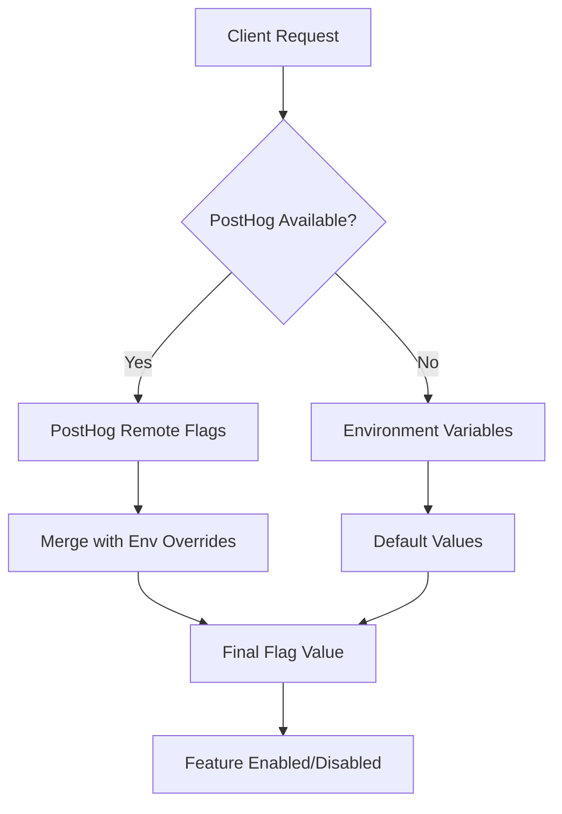

# Feature Flags System

This document describes the comprehensive feature flag system implemented in Morning Pod using PostHog for remote flag management and environment variable overrides for emergency controls.

## Overview

The feature flag system allows you to:

- **Control premium/expensive features** (AI summarization, premium TTS)
- **Toggle content sources** (TLDR, Hacker News, Morning Brew, TechCrunch)
- **Manage content tiers** (premium vs free content)
- **Set generation limits** (daily limits, unlimited generation)
- **Control UI features** (advanced player, real-time queue, visual cards)

## Architecture



## Flag Evaluation Priority

1. **PostHog remote flags** (if configured and available)
2. **Environment variable overrides** (for emergency controls)
3. **Default values** (defined in code)

## Available Feature Flags

### Premium/Expensive Features

- `premium-tts-enabled` - Enable premium TTS services
- `ai-summarization-enabled` - Enable AI content summarization
- `openai-tts-enabled` - Enable OpenAI TTS service
- `google-tts-enabled` - Enable Google Cloud TTS service
- `premium-content-enabled` - Allow premium content sources
- `unlimited-generation-enabled` - Remove daily generation limits

### Content Sources

- `tldr-source-enabled` - TLDR Newsletter (premium)
- `hacker-news-source-enabled` - Hacker News (free)
- `morning-brew-source-enabled` - Morning Brew (premium)
- `techcrunch-source-enabled` - TechCrunch (free)

### Content Tiers

- `premium-content-enabled` - Allow premium content access
- `free-content-enabled` - Allow free content access

### Generation Controls

- `high-daily-limits-enabled` - Increase daily generation limits
- `unlimited-generation-enabled` - Remove all limits

### UI/UX Features

- `advanced-player-enabled` - Advanced episode player
- `real-time-queue-enabled` - Real-time queue updates
- `visual-episode-cards-enabled` - Visual episode card design

## Setup Instructions

### 1. PostHog Configuration

1. Sign up for PostHog at https://posthog.com
2. Create a new project
3. Get your project API key (starts with `phc_`)
4. Generate a personal API key for server-side usage (starts with `phx_`)
5. Add to your environment variables:

```bash
NEXT_PUBLIC_POSTHOG_KEY="phc_your_key_here"
NEXT_PUBLIC_POSTHOG_HOST="https://us.i.posthog.com"
POSTHOG_SERVER_KEY="phx_your_server_key_here"
```

### 2. Environment Variable Overrides

Add these to your `.env.local` for local development or emergency production overrides:

```bash
# Premium Features
PREMIUM_TTS_ENABLED="true"
AI_SUMMARIZATION_ENABLED="true"
OPENAI_TTS_ENABLED="true"
GOOGLE_TTS_ENABLED="true"

# Source Availability
TLDR_SOURCE_ENABLED="true"
HACKER_NEWS_SOURCE_ENABLED="true"
MORNING_BREW_SOURCE_ENABLED="true"
TECHCRUNCH_SOURCE_ENABLED="false"

# Content Tiers
PREMIUM_CONTENT_ENABLED="true"
FREE_CONTENT_ENABLED="true"

# Generation Limits
HIGH_DAILY_LIMITS_ENABLED="false"
UNLIMITED_GENERATION_ENABLED="false"
```

## Usage Examples

### Client-Side (React Components)

```tsx
import {
  useFeatureFlag,
  useSourceFlags,
  usePremiumFlags,
} from "@/lib/feature-flags";

function MyComponent() {
  // Single flag
  const isAIEnabled = useFeatureFlag("ai-summarization-enabled");

  // Multiple related flags
  const sourceFlags = useSourceFlags();
  const premiumFlags = usePremiumFlags();

  // Conditional rendering
  if (!isAIEnabled) {
    return <div>AI features are currently disabled</div>;
  }

  return (
    <div>
      {sourceFlags["tldr-source-enabled"] && <TLDRSource />}
      {premiumFlags["premium-tts-enabled"] && <PremiumTTSOptions />}
    </div>
  );
}
```

### Server-Side (API Routes & Server Components)

```tsx
import {
  getFeatureFlag,
  getEnabledSources,
  isPremiumContentEnabled,
} from "@/lib/feature-flags";

// In API route
export async function POST(request: Request) {
  const isAIEnabled = await getFeatureFlag("ai-summarization-enabled");

  if (!isAIEnabled) {
    return Response.json({ error: "AI features disabled" }, { status: 503 });
  }

  // Continue with AI processing...
}

// In server component
export default async function SourcesPage() {
  const allSources = await getSources();
  const enabledSources = await getEnabledSources(allSources);

  return (
    <div>
      {enabledSources.map((source) => (
        <SourceCard key={source.id} source={source} />
      ))}
    </div>
  );
}
```

### tRPC Integration

```tsx
// In tRPC router
export const sourcesRouter = createTRPCRouter({
  getAll: publicProcedure.query(async () => {
    const allSources = await getAllSources();
    return await getEnabledSources(allSources); // Automatically filters by flags
  }),
});
```

## Feature Flag Admin Interface

The system includes a built-in admin interface accessible via the "Feature Flags" button in the top navigation. This shows:

- Current status of all flags (ON/OFF)
- Cost information for premium features
- Flag evaluation order
- Grouping by feature type (Premium, Sources, UI, Limits)

## Visual Regression Testing

Comprehensive visual regression tests are included to ensure UI consistency across different feature flag states:

```bash
# Run all feature flag visual tests
bun test:e2e:flags

# Update visual baselines for feature flag scenarios
bun test:e2e:visual:flags
```

Test scenarios include:

- All features enabled
- Premium features disabled
- Limited sources only
- Different responsive breakpoints
- Error and loading states with various flag combinations

## Emergency Controls

### Quick Disable Premium Features

Set these environment variables to immediately disable expensive features:

```bash
PREMIUM_TTS_ENABLED="false"
AI_SUMMARIZATION_ENABLED="false"
OPENAI_TTS_ENABLED="false"
PREMIUM_CONTENT_ENABLED="false"
```

### Source-Specific Outages

If a specific source is having issues:

```bash
TLDR_SOURCE_ENABLED="false"          # Disable TLDR
MORNING_BREW_SOURCE_ENABLED="false"  # Disable Morning Brew
```

### Cost Control

Limit expensive operations:

```bash
UNLIMITED_GENERATION_ENABLED="false"
HIGH_DAILY_LIMITS_ENABLED="false"
```

## Monitoring & Analytics

PostHog automatically tracks:

- Feature flag evaluation events
- User interactions with flagged features
- Performance impact of different flag states
- A/B test results for UI variants

## Best Practices

### 1. Flag Naming Convention

- Use kebab-case: `feature-name-enabled`
- Always end with `-enabled` for boolean flags
- Group related flags with prefixes: `source-`, `premium-`, `ui-`

### 2. Default Values

- Premium features: Default to `true` in development, `false` in production
- Free features: Default to `true` everywhere
- Sources: Default based on current availability

### 3. Gradual Rollouts

- Start with 0% rollout for new features
- Gradually increase to 5%, 25%, 50%, 100%
- Monitor performance and error rates at each step

### 4. Flag Lifecycle

- **Development**: Test with flags enabled/disabled
- **Staging**: Mirror production flag state
- **Production**: Use PostHog for gradual rollouts
- **Cleanup**: Remove flags after 100% rollout and code cleanup

### 5. Emergency Procedures

- Environment variables override PostHog for immediate control
- Document emergency contacts and procedures
- Test emergency disable scenarios regularly

## Cost Estimation

The system includes cost tracking for premium features:

```tsx
import { FeatureFlagUtils } from "@/lib/feature-flags";

const cost = FeatureFlagUtils.getFeatureCost("ai-summarization-enabled");
// Returns estimated cost per operation in USD
```

Current cost estimates:

- AI Summarization: $0.01 per operation
- OpenAI TTS: $0.015 per 1000 characters
- Google TTS: $0.016 per 1000 characters
- Premium Content: $0.005 per access

## Troubleshooting

### Flags Not Updating

1. Check PostHog API key configuration
2. Verify network connectivity to PostHog
3. Check browser console for errors
4. Ensure environment variables are properly set

### Performance Issues

1. Monitor flag evaluation frequency
2. Use server-side evaluation for expensive operations
3. Cache flag values when appropriate
4. Consider flag evaluation impact on page load

### Testing Issues

1. Use environment variable overrides for consistent test environments
2. Mock PostHog in unit tests
3. Use visual regression tests to catch UI changes
4. Test both enabled and disabled states

## Migration Guide

### From Environment Variables Only

1. Set up PostHog account and keys
2. Create flags in PostHog dashboard
3. Gradually migrate from env vars to PostHog
4. Keep env vars as emergency overrides

### Adding New Flags

1. Add flag to `FEATURE_FLAGS` constant
2. Add default value to `DEFAULT_FLAG_VALUES`
3. Add environment override to `getEnvironmentFlagOverrides`
4. Create PostHog flag with same key
5. Add to relevant utility functions
6. Update documentation and tests

## Security Considerations

- **Client-side flags**: Visible to users, don't use for sensitive features
- **Server-side flags**: Secure, use for premium/paid features
- **API keys**: Keep PostHog server keys secure and rotate regularly
- **Environment variables**: Use secure deployment practices

## Support

For issues with the feature flag system:

1. Check this documentation
2. Review PostHog dashboard for flag status
3. Check application logs for flag evaluation errors
4. Use the built-in Feature Flag Admin interface for debugging
