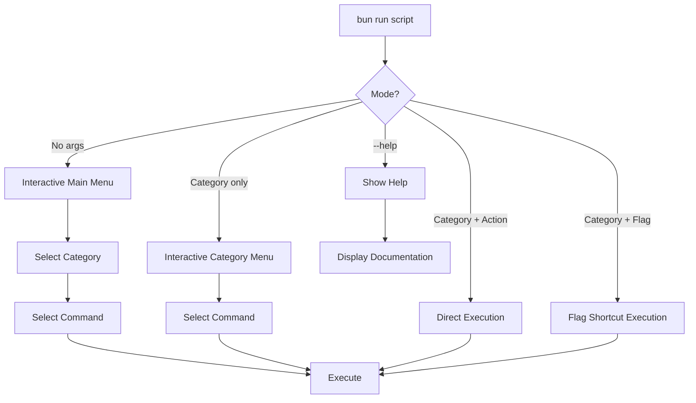

# 🎯 Interactive Script Runner

The Interactive Script Runner provides a unified interface for executing development tasks with both interactive menus and direct command execution.

## Features

- 🔍 **Type-to-filter** interactive menus
- 🚀 **Quick flag shortcuts** for common tasks
- 📋 **Organized categories** (test, dev, quality, db, deps, release)
- 🎨 **Beautiful CLI interface** with icons and colors
- ⚡ **Direct execution** for automation
- 👋 **Graceful exit handling** (Ctrl+C)

## Usage Modes



## Quick Reference

### Interactive Modes

```bash
# Main interactive menu - choose category then command
bun run script

# Category interactive menu - choose command within category
bun run test
bun run dev
bun run quality
bun run db
bun run deps
bun run release
```

### Direct Execution

```bash
# Run specific commands directly
bun run test unit
bun run dev build
bun run quality lint
bun run db migrate
```

### Flag Shortcuts

```bash
# Quick shortcuts with flags
bun run test --e2e          # Run E2E tests
bun run test --watch        # Run unit tests in watch mode
bun run test --all          # Run all tests
bun run dev --build         # Build for production
bun run quality --all       # Run all quality checks
```

## Command Categories

### 🧪 Testing (`bun run test`)

| Flag            | Command         | Description                            |
| --------------- | --------------- | -------------------------------------- |
| `--unit`        | `unit`          | Run unit tests with Vitest             |
| `--watch`       | `unit:watch`    | Run unit tests in watch mode           |
| `--ui`          | `unit:ui`       | Run unit tests with UI                 |
| `--coverage`    | `unit:coverage` | Run unit tests with coverage           |
| `--perf`        | `unit:perf`     | Run unit tests (performance optimized) |
| `--e2e`         | `e2e`           | Run E2E tests with Playwright          |
| `--debug`       | `e2e:debug`     | Debug E2E tests                        |
| `--headed`      | `e2e:headed`    | Run E2E tests in headed mode           |
| `--visual`      | `e2e:visual`    | Update visual regression snapshots     |
| `--performance` | `performance`   | Run performance tests                  |
| `--all`         | `all`           | Run all tests (unit + E2E)             |

**Examples:**

```bash
bun run test                # Interactive menu
bun run test --e2e          # Quick E2E tests
bun run test --watch        # Unit tests in watch mode
bun run test --all          # Run everything
```

### 🚀 Development (`bun run dev`)

| Flag        | Command   | Description                         |
| ----------- | --------- | ----------------------------------- |
| `--start`   | `start`   | Start development server with Turbo |
| `--build`   | `build`   | Build for production                |
| `--preview` | `preview` | Start production server             |
| `--clean`   | `clean`   | Clean install dependencies          |

**Examples:**

```bash
bun run dev                 # Interactive menu
bun run dev --start         # Start dev server
bun run dev --build         # Production build
```

### ✨ Quality (`bun run quality`)

| Flag       | Command        | Description                  |
| ---------- | -------------- | ---------------------------- |
| `--lint`   | `lint`         | Run ESLint                   |
| `--fix`    | `lint:fix`     | Fix ESLint issues            |
| `--format` | `format`       | Format code with Prettier    |
| `--check`  | `format:check` | Check code formatting        |
| `--type`   | `type-check`   | Run TypeScript type checking |
| `--all`    | `all`          | Run all quality checks       |

**Examples:**

```bash
bun run quality             # Interactive menu
bun run quality --lint      # Just linting
bun run quality --all       # Everything
```

### 🗄️ Database (`bun run db`)

| Flag         | Command    | Description                  |
| ------------ | ---------- | ---------------------------- |
| `--generate` | `generate` | Generate database migrations |
| `--migrate`  | `migrate`  | Push migrations to database  |
| `--seed`     | `seed`     | Seed database with test data |
| `--studio`   | `studio`   | Open Drizzle Studio          |

**Examples:**

```bash
bun run db                  # Interactive menu
bun run db --migrate        # Apply migrations
bun run db --studio         # Open DB studio
```

### 📦 Dependencies (`bun run deps`)

| Flag         | Command        | Description                    |
| ------------ | -------------- | ------------------------------ |
| `--check`    | `check`        | Check for available updates    |
| `--patch`    | `update:patch` | Update patch versions (safest) |
| `--minor`    | `update:minor` | Update minor versions          |
| `--major`    | `update:major` | Show major updates             |
| `--safe`     | `update:safe`  | Update with automatic testing  |
| `--doctor`   | `doctor`       | Automated safe updates         |
| `--outdated` | `outdated`     | Show outdated packages         |

**Examples:**

```bash
bun run deps                # Interactive menu
bun run deps --check        # Check updates
bun run deps --safe         # Safe update with tests
```

### 🚢 Release (`bun run release`)

| Flag          | Command     | Description                           |
| ------------- | ----------- | ------------------------------------- |
| `--changeset` | `changeset` | Create a new changeset                |
| `--version`   | `version`   | Version packages and update changelog |
| `--publish`   | `publish`   | Publish packages                      |
| `--status`    | `status`    | Check changeset status                |
| `--release`   | `release`   | Full release process                  |

**Examples:**

```bash
bun run release             # Interactive menu
bun run release --changeset # Create changeset
bun run release --release   # Full release
```

### 🛠️ Utilities (`bun run utils` or `bun kill`)

| Flag      | Command      | Description                               |
| --------- | ------------ | ----------------------------------------- |
| `--force` | `kill:force` | Force kill all test/lint/VSCode processes |
| `--list`  | `kill:list`  | List running processes without killing    |

**Examples:**

```bash
bun kill                    # Interactive process selection (default)
bun kill --force            # Force kill all processes immediately
bun kill --list             # Just show what's running

# Alternative syntax
bun run utils               # Interactive menu
bun run utils kill          # Interactive process killer
```

The interactive kill process tool targets:

- Vitest processes
- Playwright processes
- ESLint processes
- TypeScript language server
- VSCode helper processes
- Related node/bun processes

## Interactive Experience

### Type-to-Filter

The interactive menus support real-time filtering:

```bash
bun run test
# Type "watch" → filters to watch-related commands
# Type "e2e" → filters to E2E commands
# Type "unit" → filters to unit test commands
```

### Navigation

- **Arrow keys**: Navigate options
- **Type**: Filter options in real-time
- **Enter**: Select option
- **Ctrl+C**: Exit gracefully with "👋 See you later!"

## Advanced Usage

### Combining with Package Scripts

The runner integrates with your `package.json` scripts:

```json
{
  "scripts": {
    "script": "bun run tools/scripts/run.ts",
    "test": "bun run tools/scripts/run.ts test",
    "dev": "bun run tools/scripts/run.ts dev",
    "quality": "bun run tools/scripts/run.ts quality"
  }
}
```

### Automation-Friendly

Perfect for CI/CD and scripts:

```bash
# In GitHub Actions
bun run test --all
bun run quality --all
bun run dev --build

# In pre-commit hooks
bun run quality --lint --fix
```

### Help System

```bash
bun run script --help       # Show comprehensive help
```

## Implementation Details

### Architecture

- **TypeScript-first**: Full type safety and IntelliSense
- **Modular design**: Easy to add new categories and commands
- **Graceful error handling**: Proper exit codes and messages
- **Beautiful UI**: Uses `@clack/prompts` and `@inquirer/prompts`

### File Structure

```
tools/scripts/
├── run.ts                  # Main script runner
└── tests/
    ├── script-runner.test.ts   # Unit tests
    └── fixtures/               # Test fixtures
```

### Configuration

Commands are defined in the `ScriptRunner` class with this structure:

```typescript
interface ScriptCommand {
  name: string;
  description: string;
  command: string;
  category?: string;
}

interface ScriptCategory {
  name: string;
  description: string;
  icon: string;
  commands: ScriptCommand[];
}
```

## Troubleshooting

### Common Issues

**"Script runner failed" errors:**

- Usually indicates a command syntax error
- Check the command definition in the script
- Verify all required tools are installed

**Interactive menu not showing:**

- Ensure `@clack/prompts` and `@inquirer/prompts` are installed
- Check terminal supports interactive input

**Ctrl+C shows error instead of nice message:**

- This is fixed in the latest version
- Should show "👋 See you later!" message

### Development

To modify or extend the script runner:

1. **Add new commands**: Edit the `categories` array in `ScriptRunner`
2. **Add new flags**: Update the `categoryFlagMap` in `parseArgs()`
3. **Test changes**: Run the test suite
4. **Update docs**: Keep this documentation current

## Examples in Practice

### Development Workflow

```bash
# Start development
bun run dev --start

# In another terminal, run tests in watch mode
bun run test --watch

# Before committing
bun run quality --all
```

### CI/CD Pipeline

```bash
# Install dependencies
bun install

# Run all quality checks
bun run quality --all

# Run all tests
bun run test --all

# Build for production
bun run dev --build
```

### Database Management

```bash
# Generate new migration
bun run db --generate

# Apply migrations
bun run db --migrate

# Seed with test data
bun run db --seed

# Open studio to inspect
bun run db --studio
```

This script runner makes development more enjoyable and productive by providing a consistent, discoverable interface for all project tasks! 🎉
