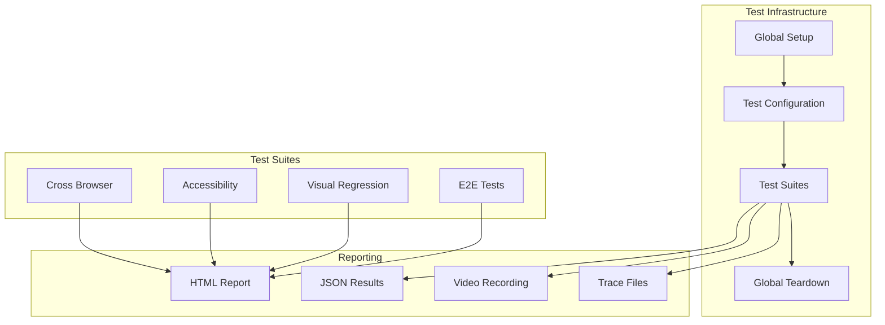
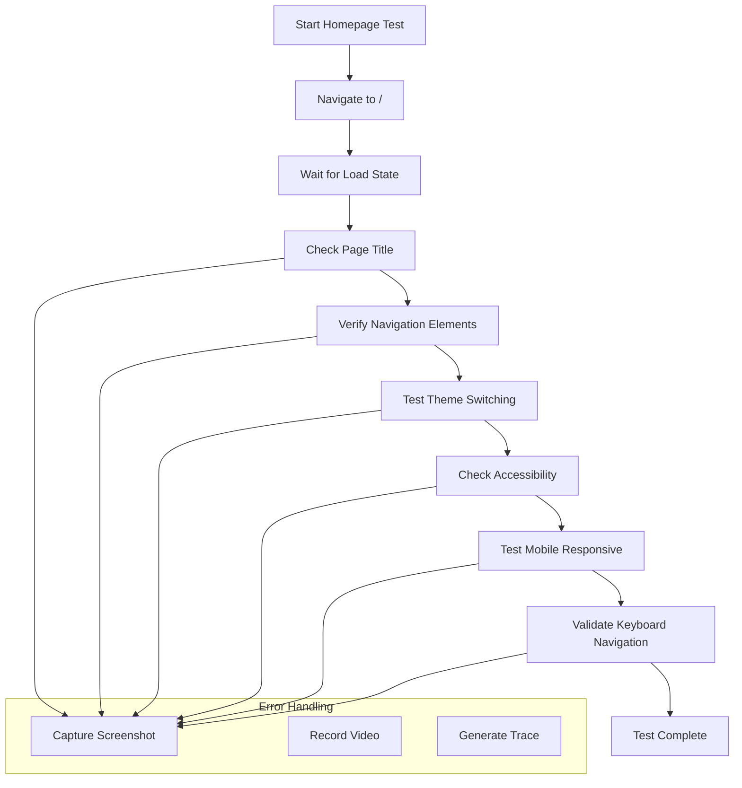
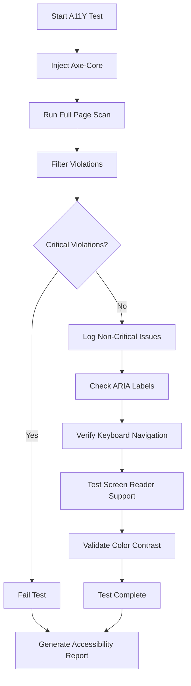
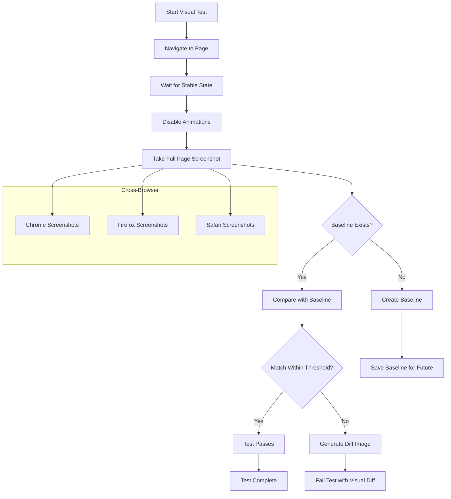
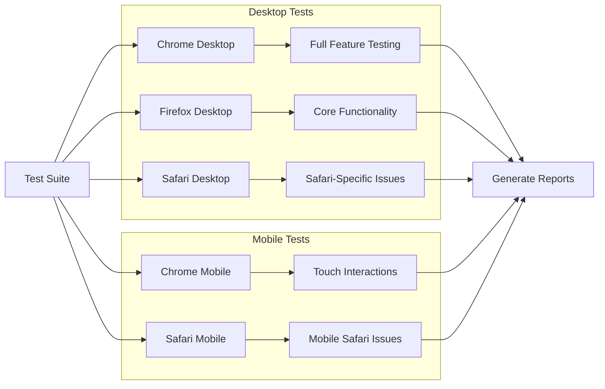
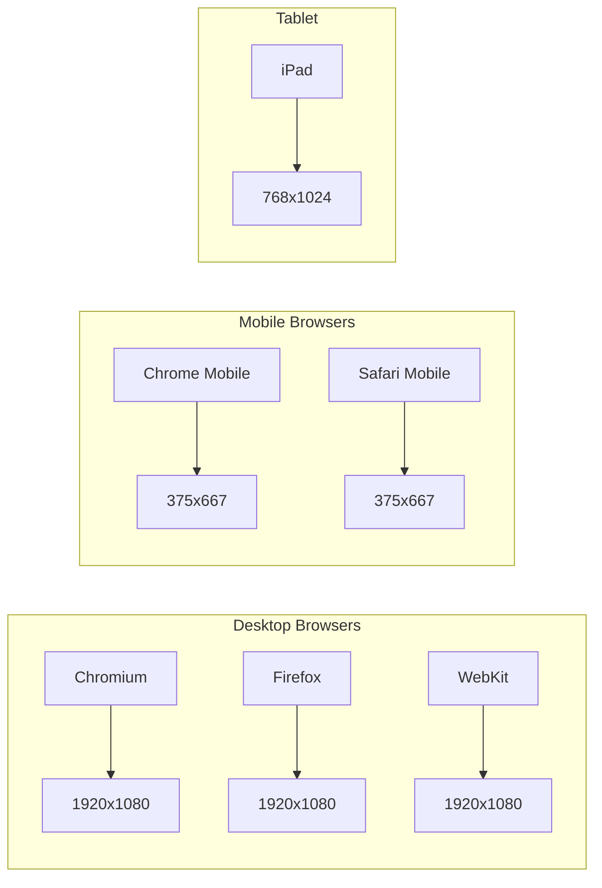
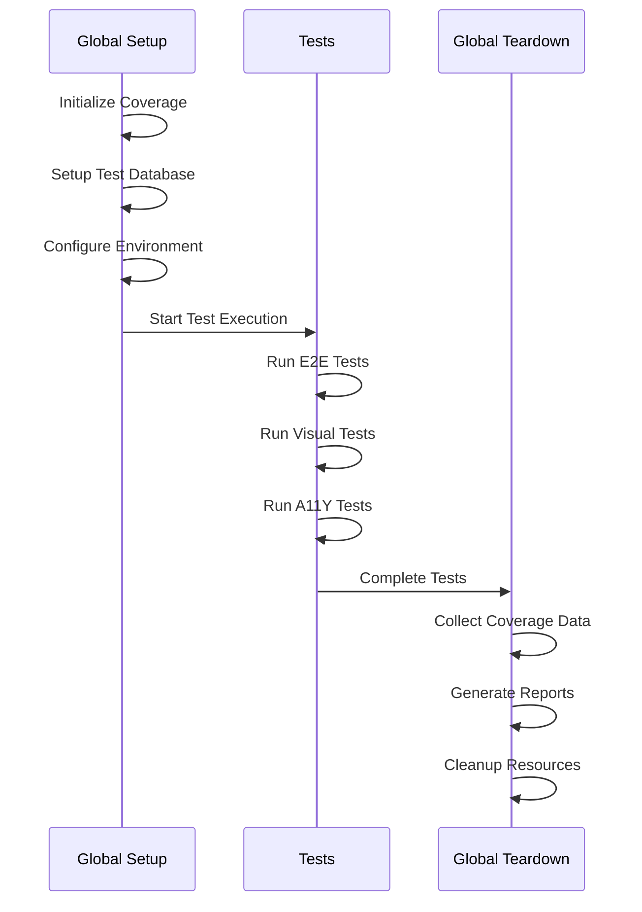
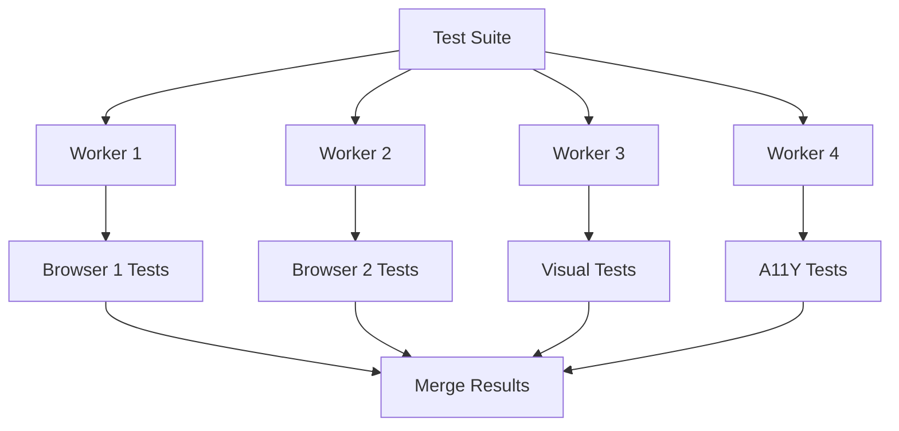
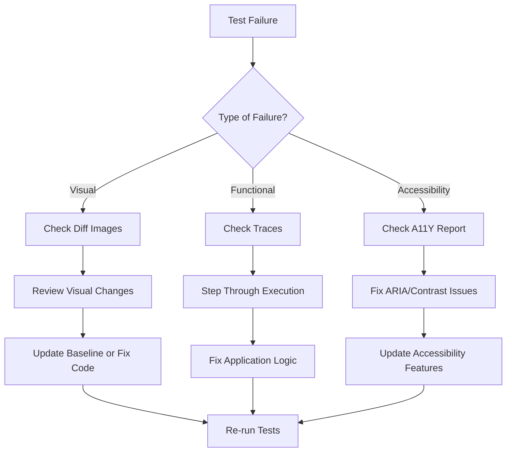
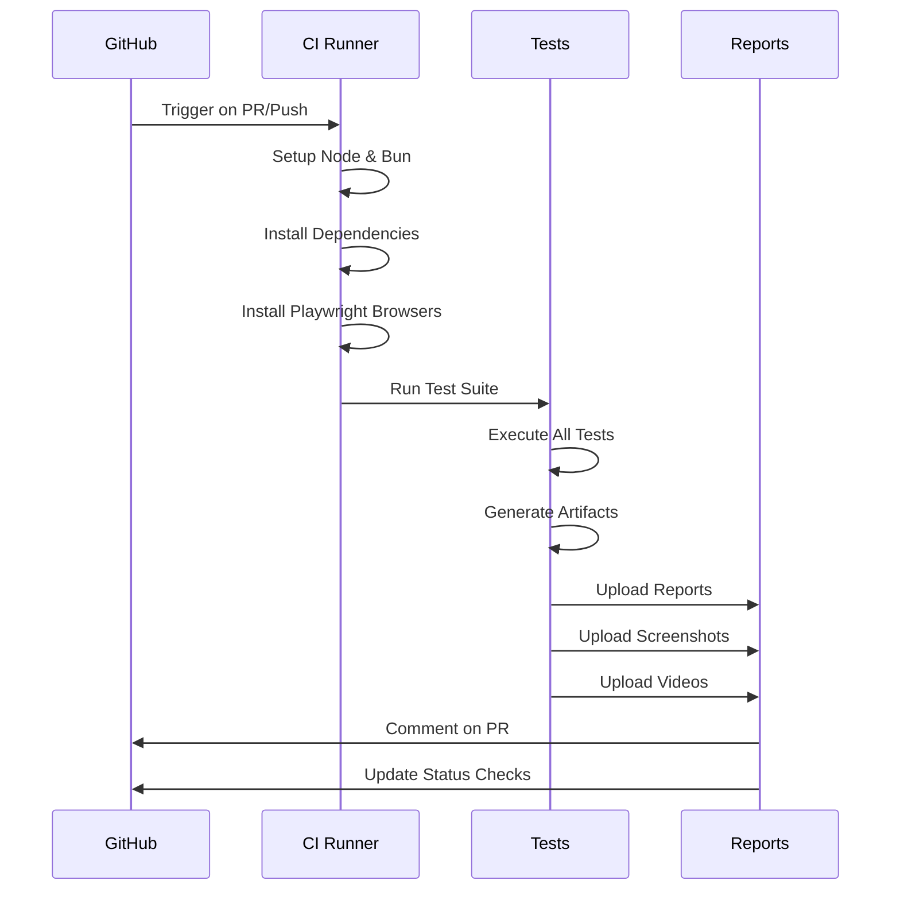

# Morning Pod - Test Infrastructure

## Overview

This directory contains our comprehensive testing infrastructure built with Playwright, focusing on end-to-end testing, accessibility compliance, visual regression testing, and cross-browser compatibility.

## Test Architecture



## Test Flow Diagrams

### 1. Homepage E2E Test Flow



### 2. Accessibility Testing Flow



### 3. Visual Regression Testing Flow



### 4. Cross-Browser Testing Strategy



## Test Categories

### 1. End-to-End (E2E) Tests

**Location**: `src/tests/e2e/homepage.spec.ts`

- **Core functionality testing**
- **User journey validation**
- **Navigation and routing**
- **Form interactions**
- **API integration testing**

### 2. Visual Regression Tests

**Location**: `src/tests/e2e/visual-regression.spec.ts`

- **Full page screenshots**
- **Component-level screenshots**
- **Responsive design validation**
- **Cross-browser visual consistency**
- **Hover and interaction states**

### 3. Accessibility Tests

**Location**: `src/tests/e2e/homepage.spec.ts` (integrated)

- **WCAG 2.1 compliance**
- **Screen reader compatibility**
- **Keyboard navigation**
- **Color contrast validation**
- **ARIA labels and roles**

## Test Configuration

### Browser Matrix



### Test Environments

- **Development**: `npm run test:e2e`
- **CI/CD**: Automated on PR and main branch
- **Staging**: Pre-deployment validation
- **Production**: Smoke tests

## Advanced Features

### 1. Global Setup & Teardown



### 2. Screenshot Management Strategy

**Platform-Specific Screenshots**:

```
tests/
├── screenshots/
│   ├── homepage-chromium-linux.png     # CI/CD baselines
│   ├── homepage-firefox-linux.png      # CI/CD baselines
│   ├── homepage-webkit-linux.png       # CI/CD baselines
│   └── actual/                          # Failed test outputs
│       ├── homepage-chromium-linux-actual.png
│       └── homepage-chromium-linux-diff.png
```

### 3. Parallel Test Execution



## Commands Reference

### Basic Test Commands

```bash
# Run all tests
bun test:e2e

# Run with UI for debugging
bun test:e2e:headed

# Run specific test file
bunx playwright test homepage.spec.ts

# Run with trace recording
bun test:e2e:trace

# Generate visual regression baselines
bunx playwright test --update-snapshots
```

### Advanced Commands

```bash
# Run tests with coverage
bun test:e2e:coverage

# Generate test report
bun test:e2e:report

# Run visual regression tests only
bun test:e2e:visual

# Debug specific test in UI mode
bunx playwright test --debug homepage.spec.ts

# Run tests on specific browser
bunx playwright test --project=chromium
```

## Debugging & Development

### Test Debugging Flow



### Development Workflow

1. **Write test** with clear assertions
2. **Run locally** to verify functionality
3. **Check cross-browser** compatibility
4. **Validate accessibility** compliance
5. **Update visual baselines** if needed
6. **Commit changes** with test updates

## CI/CD Integration

### GitHub Actions Workflow



## Visual Regression Management

### Git LFS Strategy (Recommended)

For managing visual regression screenshots, we recommend using Git LFS:

```bash
# Install Git LFS
brew install git-lfs  # macOS
git lfs install

# Track PNG files in test directory
echo "src/tests/**/*.png filter=lfs diff=lfs merge=lfs -text" >> .gitattributes
```

**Benefits**:

- ✅ Version control for visual baselines
- ✅ Team collaboration on visual changes
- ✅ Smaller repository size
- ✅ Easy rollback of visual changes

**Alternative**: Store in cloud storage (S3, etc.) but adds complexity.

## Best Practices

### 1. Test Reliability

- Use `data-testid` for stable selectors
- Wait for network idle before screenshots
- Disable animations in visual tests
- Handle flaky tests with retry logic

### 2. Maintenance

- Regular baseline updates
- Clean up unused screenshots
- Monitor test execution times
- Review and update selectors

### 3. Performance

- Run tests in parallel
- Use appropriate timeouts
- Minimize test data setup
- Cache dependencies in CI

### 4. Accessibility

- Test with screen readers
- Validate keyboard navigation
- Check color contrast ratios
- Ensure proper ARIA labels

## Troubleshooting

### Common Issues

**Visual Test Failures**:

- Platform differences (Linux vs macOS)
- Font rendering variations
- Animation timing issues

**Accessibility Failures**:

- Missing ARIA labels
- Insufficient color contrast
- Broken keyboard navigation

**Cross-Browser Issues**:

- Safari-specific behaviors
- Mobile viewport differences
- Touch interaction problems

### Solutions

1. **Use Docker** for consistent screenshots
2. **Implement retry logic** for flaky tests
3. **Set proper timeouts** for slow operations
4. **Mock external dependencies** when possible

## Metrics & Reporting

Our test infrastructure generates comprehensive reports:

- **HTML Report**: Interactive test results
- **JUnit XML**: CI/CD integration
- **JSON Results**: Custom processing
- **Coverage Reports**: Code coverage metrics
- **Accessibility Reports**: WCAG compliance

## Future Enhancements

- [ ] Performance testing integration
- [ ] API testing expansion
- [ ] Mobile app testing
- [ ] Load testing capabilities
- [ ] Advanced visual AI comparisons

---

_For technical questions or test infrastructure improvements, contact the development team or create an issue._
